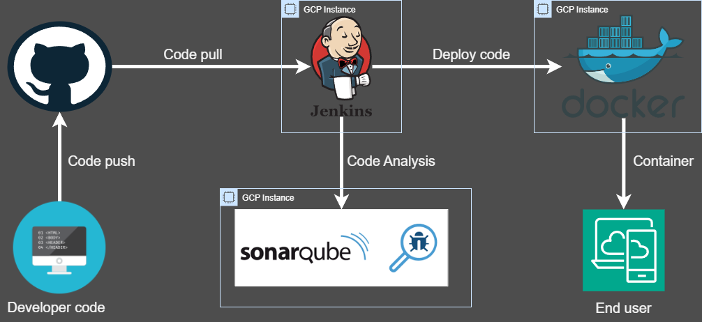

# Project Title: CI/CD Pipeline with Jenkins, SonarQube, and Docker
 

## **Project Overview:**
This project involves setting up a Continuous Integration and Continuous Deployment (CI/CD) pipeline using Jenkins, SonarQube, and Docker on Google Cloud Platform (GCP). The pipeline is designed to automate the process of code integration, testing, and deployment, ensuring a streamlined and efficient workflow for delivering high-quality software.

### **Architecture Details:**

1. **Developer Code:**
   - Developers write and push their code to a GitHub repository.
   - GitHub acts as the version control system where the codebase is stored and managed.

2. **Code Push and Pull:**
   - Developers push their code changes to GitHub.
   - Jenkins, hosted on a GCP instance, is configured to automatically pull the latest code from the GitHub repository whenever changes are detected.

3. **Jenkins:**
   - Jenkins serves as the automation server, orchestrating the entire CI/CD process.
   - Upon code pull, Jenkins triggers a build process, running various stages such as code compilation, testing, and deployment.
   - Jenkins integrates with SonarQube for static code analysis and quality checks.

4. **SonarQube:**
   - SonarQube is hosted on a separate GCP instance.
   - Jenkins sends the code to SonarQube for static code analysis.
   - SonarQube performs a thorough analysis to identify code quality issues, security vulnerabilities, and code smells.
   - The analysis results are reported back to Jenkins, where they can be reviewed by developers.

5. **Docker:**
   - Once the code passes the analysis phase, Jenkins deploys the application using Docker.
   - Docker containers are created to ensure consistent and isolated environments for the application, enhancing portability and scalability.
   - The containers are hosted on a GCP instance, ready to be accessed by end users.

6. **End User:**
   - The deployed application is made available to end users through a web interface.
   - End users can access and interact with the application, experiencing the latest features and updates.

### **Key Benefits:**
- **Automated Workflow:** The CI/CD pipeline automates the entire process from code integration to deployment, reducing manual intervention and the risk of human errors.
- **Continuous Code Analysis:** Integration with SonarQube ensures continuous monitoring and improvement of code quality, leading to more robust and secure software.
- **Scalability and Portability:** Using Docker containers allows the application to be easily scaled and deployed across different environments without compatibility issues.
- **Cloud-Based Infrastructure:** Leveraging GCP for hosting Jenkins, SonarQube, and Docker provides a reliable and scalable infrastructure, ensuring high availability and performance.

### **Conclusion:**
This project demonstrates the implementation of a robust CI/CD pipeline using industry-standard tools and cloud infrastructure. By automating the software delivery process and integrating continuous code analysis, the project aims to enhance the efficiency, quality, and reliability of software development and deployment.
